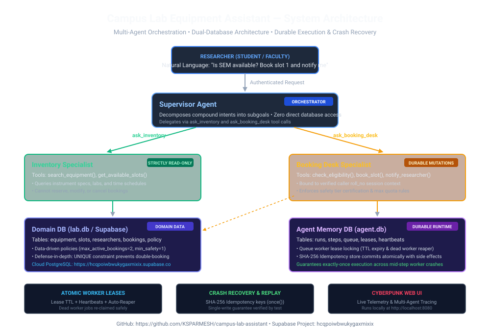
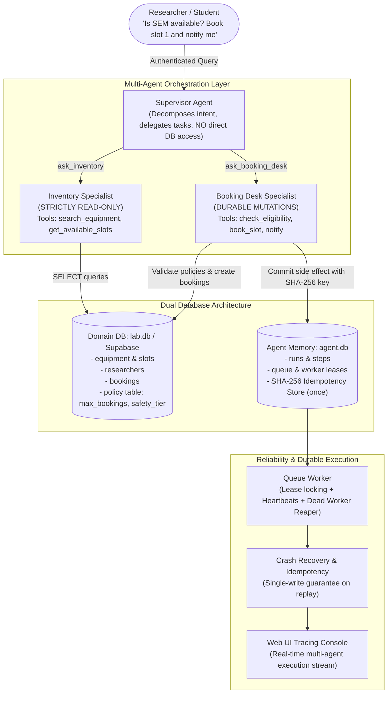

# Campus Lab Equipment Assistant: System Design & Architectural Decisions



An autonomous multi-agent system designed for scientific equipment scheduling, safety tier validation, clash prevention, and durable execution across crashes.

---

## Visual Architecture Diagram



### ASCII Architecture Flowchart

```text
               Researcher (Student / Faculty)
                             │
                     [Plain Text Prompt]
                             ▼
                    ┌─────────────────┐
                    │ Supervisor Agent│ (Orchestrator)
                    └────────┬────────┘
                             │
             ┌───────────────┴───────────────┐
             │ ask_inventory                 │ ask_booking_desk
             ▼                               ▼
    ┌──────────────────┐           ┌───────────────────┐
    │ Inventory Agent  │           │ Booking Desk Agent│
    │ (Strictly Read)  │           │  (Read & Write)   │
    └────────┬─────────┘           └─────────┬─────────┘
             │                               │
             │ [SELECT]                      │ [Validate & Mutate]
             ▼                               ▼
    ┌────────────────────────┐      ┌────────────────────────┐
    │       Domain DB        │      │    Agent Memory DB     │
    │  (lab.db / Supabase)   │      │       (agent.db)       │
    │                        │      │                        │
    │ • equipment, slots     │      │ • runs, steps, queue   │
    │ • researchers          │      │ • leases & heartbeats  │
    │ • business policies    │      │ • SHA-256 idempotency  │
    └────────────────────────┘      └────────────────────────┘
                 │                               │
                 └───────────────┬───────────────┘
                                 ▼
                     ┌───────────────────────┐
                     │ Durable Worker Engine │
                     │   - Lease Reclaiming  │
                     │   - Single-Write Test │
                     │   - Crash Recovery    │
                     └───────────────────────┘
```

---

## Key Architectural Principles

### 1. Database Separation Principle
The architecture strictly enforces separation between **Agent Memory** (`agent.db`) and **Domain Business Data** (`lab.db` / Supabase):
- **Agent Memory**: Handles threads, conversations, run execution steps, tool call latencies, and worker leasing. All message inserts are append-only.
- **Domain Business Data**: Stores researchers, scientific instruments, time slots, business policies, confirmed bookings, and notifications.
- **Why this separation matters**: If an LLM hallucinates or a run crashes, the domain state remains uncorrupted. The agent's memory can be inspected, replayed, or purged without impacting student records or physical laboratory bookings.

### 2. Business Rules in Data, Not Prompts
LLMs can misinterpret complex conditional logic in system prompts. Therefore, all business constraints are stored in a dedicated `policy` table in the database:
- `max_active_bookings`: Maximum simultaneous active bookings allowed per researcher (default: 2).
- `min_safety_level_req`: Strict safety certification level validation (default: 1).
- `advance_booking_days`: Window for scheduling slots in advance (default: 7).

The tool `check_eligibility()` queries these policies directly from the database. Furthermore, `book_slot()` defensively validates the policy before writing, ensuring that even if an agent hallucinates or skips the check, the database rejects invalid operations.

### 3. Durable Execution & Crash Replay Recovery
Agent workflows often fail due to network hiccups, worker restarts, or process kills. The durable execution model solves this via:
- **Lease Ownership**: Workers claim runs with an atomic lease expiry timestamp (`lease_until`).
- **Heartbeats**: The worker periodically extends the lease between execution steps.
- **Reaper**: If a worker dies, other workers identify expired leases (`reap_expired()`) and reclaim the job.
- **Idempotency Keys**: Every side-effect tool call derives a deterministic SHA-256 hash from `(run_id, step_seq, tool_name, args)`. Side-effect results and keys commit in a single atomic database transaction via `once()`.
- **Replay Safety**: When worker B resumes after worker A crashes, re-running a completed tool returns the cached result without repeating the physical booking or sending duplicate notifications.

### 4. Multi-Agent Coordination & Least Privilege
The system adopts the **Agent-as-Tool** pattern:
- **Supervisor**: Communicates with the user, breaks down multi-step intents, and delegates to specialist subagents (`ask_inventory` and `ask_booking_desk`). It has **no** access to database queries or booking mutations directly.
- **Inventory Specialist**: Possesses only read-only search and slot availability tools. It cannot make reservations or alter state.
- **Booking Desk Specialist**: Bound to the specific researcher's authenticated roll number. The LLM cannot forge or alter the roll number parameter because it is injected by the server session context.

### 5. Supabase Cloud PostgreSQL Integration
The system provides first-class support for Supabase:
- Complete PostgreSQL schema with triggers for append-only tables and unique constraints for clash prevention.
- Dual-mode connection: automatically connects to Supabase if `SUPABASE_URL` and `SUPABASE_KEY` are provided in `.env`, or seamlessly operates using local SQLite files for completely offline environments and automated grading.

---

## Architectural Artifacts
- **Vector SVG Diagram**: [`docs/architecture_diagram.svg`](architecture_diagram.svg)
- **High-Res Printable PDF Diagram**: [`docs/architecture_diagram.pdf`](architecture_diagram.pdf)
